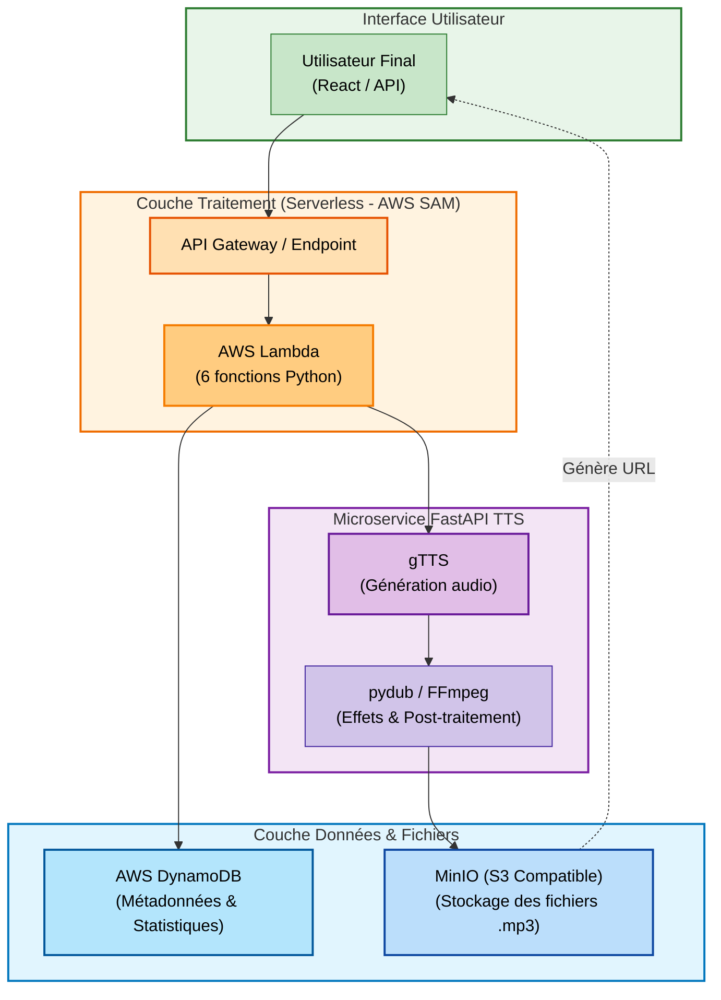

# 🎙️ VOICEFAKER — Générateur de Voix IA


VOICEFAKER est une solution de synthèse vocale (TTS) conçue pour transformer instantanément tout texte en un flux audio réaliste. En exploitant le moteur **gTTS** combiné à des effets audio post-traitement, l'application permet de générer des voix synthétiques dans plusieurs langues et styles pour divers usages créatifs et techniques.

## 🌟 Fonctionnalités principales

*   📝 **Saisie texte** : Interface intuitive pour la soumission de contenus textuels.
*   🎭 **Effets vocaux** : 6 styles de voix disponibles (default, dark_vador, robot, cartoon, masculine_rock, child).
*   🌍 **Multi-langues** : Support de 5 langues (français, anglais, espagnol, allemand, italien).
*   🎵 **Transformation audio** : Post-traitement automatique via pydub & FFmpeg pour optimiser le rendu sonore.
*   💾 **Stockage cloud** : Archivage sécurisé sur MinIO (S3-compatible).
*   📥 **Téléchargement direct** : Récupération rapide des fichiers audio générés.
*   📊 **Statistiques** : Analyse des pics d'activité, des langues et des voix les plus demandées.

## 🏗️ Architecture du projet

Le projet repose sur une infrastructure **Serverless** orchestrée autour de 6 lambdas AWS SAM, d'un microservice FastAPI dédié à la génération audio, et d'un stockage dual DynamoDB + MinIO.



## 🛠️ Technologies utilisées

**Back-end :**
*   **Python** : Cœur de l'application, utilisé pour les lambdas et le microservice FastAPI.
*   **FastAPI** : Microservice dédié à la génération et au téléchargement des fichiers audio.
*   **AWS Lambda + AWS SAM** : Exécution serverless à la demande, orchestration locale via SAM CLI.
*   **gTTS** : Moteur de synthèse vocale Google pour la génération audio multi-langues.
*   **pydub & FFmpeg** : Manipulation, effets et encodage audio (pitch, vitesse, distorsion).
*   **DynamoDB** : Stockage NoSQL pour les métadonnées et l'historique des générations.
*   **MinIO** : Stockage d'objets compatible S3 pour les fichiers audio générés.

**Front-end :**
*   **React** : Interface utilisateur pour la soumission de texte et la lecture audio.

## 📂 Structure du projet

```text
voicefaker/
│── fastapi-tts/           # Microservice FastAPI (génération & effets audio)
│── src/
│   └── lambdas/           # 6 fonctions AWS Lambda
│       ├── generate_voice_lambda.py
│       ├── download_audio_lambda.py
│       ├── list_files_lambda.py
│       ├── stats_activity_lambda.py
│       ├── stats_languages_lambda.py
│       └── stats_voices_lambda.py
│── storage/               # Script d'initialisation DynamoDB + MinIO
│── template.yaml          # Template AWS SAM
│── docker-compose.yml     # Orchestration des conteneurs
│── README.md
```

## 🚀 Lancement du projet

### Pré-requis

*   Docker
*   Python
*   AWS SAM CLI

### Commandes

```bash
# 1. Démarrer les conteneurs (DynamoDB, MinIO, FastAPI)
docker-compose up -d

# 2. Initialiser le stockage (bucket MinIO + table DynamoDB)
python .\storage\init_storage.py

# 3. Builder les lambdas
sam build

# 4. Démarrer l'API locale
sam local start-api --docker-network voicefaker_default
```

### Accès aux interfaces d'administration

| Service | URL |
|---|---|
| Console MinIO | http://localhost:9001 |
| Interface DynamoDB Admin | http://localhost:8001 |
| API locale SAM | http://127.0.0.1:3000 |

## 🔌 Endpoints disponibles

| Méthode | Route | Description |
|---|---|---|
| `POST` | `/generate` | Génère un fichier audio |
| `GET` | `/download/{file_id}` | Télécharge un fichier audio |
| `GET` | `/files` | Liste tous les fichiers générés |
| `GET` | `/stats/activity` | Pic d'activité par heure |
| `GET` | `/stats/languages` | Classement des langues |
| `GET` | `/stats/voices` | Classement des voix |

## 🧪 Tests des lambdas

### `POST /generate` — Génération audio

**Entrée :**
```json
{
  "text": "Bonjour Honorable Steve , comment tu vas ?",
  "lang": "fr",
  "voice": "default"
}
```

**Sortie :**
```json
{
  "filename": "8b4f5881-602f-4783-8d95-c1a2592ef25f.mp3"
}
```

---

### `GET /download/{file_id}` — Téléchargement audio

**Entrée :**
```
http://127.0.0.1:3000/download/8b4f5881-602f-4783-8d95-c1a2592ef25f.mp3
```

**Sortie :** Fichier audio `.mp3` prêt à être écouté.

---

### `GET /files` — Liste des fichiers

**Entrée :**
```
http://127.0.0.1:3000/files
```

**Sortie :**
```json
[
  {
    "voice": "default",
    "filename": "a73f2ace-623f-4d07-baa3-7d18b8f1f421.mp3",
    "created_at": "26/02/2026 13:51:33",
    "id": "4afeaccc-76f8-4cf1-b7ab-e516d5c09171",
    "text": "Bonjour Boss",
    "lang": "fr",
    "file_size_bytes": 5420
  },
  {
    "voice": "cartoon",
    "filename": "75526bd4-046f-4629-a20e-0e742a528345.mp3",
    "created_at": "26/02/2026 13:53:12",
    "id": "c04371d9-4db6-4d6a-a389-84e129002fd4",
    "text": "Bonjour Honorable Steve , comment tu vas ?",
    "lang": "fr",
    "file_size_bytes": 61666
  }
]
```

---

### `GET /stats/activity` — Pic d'activité

**Entrée (date précise) :**
```
http://127.0.0.1:3000/stats/activity?date=26/02/2026
```

**Entrée (plage de dates) :**
```
http://127.0.0.1:3000/stats/activity?from=01/02/2026&to=26/02/2026
```

**Sortie :**
```json
{
  "date_range": "26/02/2026",
  "total": 4,
  "peak_hour": "13h",
  "activity": [
    { "hour": "12h", "count": 1, "percentage": 25.0 },
    { "hour": "13h", "count": 3, "percentage": 75.0 }
  ]
}
```

---

### `GET /stats/languages` — Classement des langues

**Entrée :**
```
http://127.0.0.1:3000/stats/languages
```

**Sortie :**
```json
{
  "total": 4,
  "most_requested": "fr",
  "ranking": [
    { "lang": "fr", "count": 3, "percentage": 75.0 },
    { "lang": "en", "count": 1, "percentage": 25.0 }
  ]
}
```

---

### `GET /stats/voices` — Classement des voix

**Entrée :**
```
http://127.0.0.1:3000/stats/voices
```

**Sortie :**
```json
{
  "total": 4,
  "most_requested": "default",
  "ranking": [
    { "voice": "default", "count": 3, "percentage": 75.0 },
    { "voice": "cartoon", "count": 1, "percentage": 25.0 }
  ]
}
```
## 🖥️ Front-End — VoiceFaker UI

Interface React **dark glassmorphism** connectée aux lambdas SAM via Axios.

### 🚀 Lancement

```bash
cd voicefaker-front
npm install
npm start        # http://localhost:3000
```

> ⚠️ Assurez-vous que SAM tourne sur `http://127.0.0.1:3000` avant de lancer le front.

---

### 📁 Structure des dossiers

```
voicefaker-front/
│
├── public/
│   └── index.html                 # HTML racine
│
├── src/
│   │
│   ├── index.js                   # Point d'entrée React
│   ├── App.jsx                    # Routing principal — 3 vues (React Router v6)
│   │
│   ├── api/
│   │   └── api.js                 # Centralisation des appels Axios → SAM local
│   │
│   ├── components/                # Composants réutilisables
│   │   ├── Navbar.jsx             # Navigation latérale avec liens actifs
│   │   ├── AudioPlayer.jsx        # Lecteur audio : waveform, seek, téléchargement
│   │   ├── VoiceCard.jsx          # Grille de sélection des 6 effets vocaux
│   │   ├── LangSelector.jsx       # Sélecteur de langue avec drapeaux
│   │   └── StatBar.jsx            # Barre de progression animée pour les stats
│   │
│   ├── pages/                     # Vues principales
│   │   ├── Generate.jsx           # Saisie texte → sélection langue/voix → génération → lecture
│   │   ├── Files.jsx              # Liste des fichiers générés avec lecteur inline
│   │   └── Stats.jsx              # Statistiques : activité, langues, voix
│   │
│   └── styles/
│       └── globals.css            # Variables CSS, fonts (Syne + DM Mono), animations, reset
│
├── .env                           # REACT_APP_API_URL=http://127.0.0.1:3000
└── package.json                   # Dépendances : React 18, React Router, Axios
```

---

### 🧩 Pages & Fonctionnalités

| Page | Route | Description |
|---|---|---|
| **Générer** | `/generate` | Sélection langue + voix, saisie texte, génération audio et lecture instantanée |
| **Fichiers** | `/files` | Historique des générations avec lecteur audio inline et téléchargement |
| **Statistiques** | `/stats` | Analyse des pics d'activité, langues et voix les plus demandées |

---

### 🔗 Variables d'environnement

```env
REACT_APP_API_URL=http://127.0.0.1:3000
```